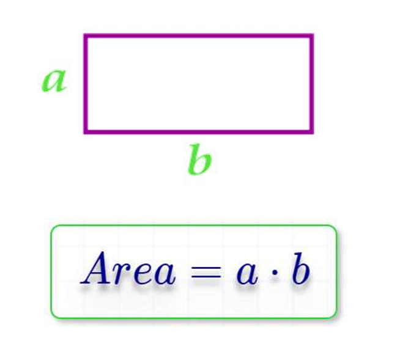

# Problem List

## Problem 1: Print Your Name

Write a program that prints your name to the screen.

### [SOLUTION](./Problem__1__Solution.png)

---

## Problem 2: Ask User for Name and Print It

Write a program that asks the user to enter their name and then prints it on the screen.

### [SOLUTION](./Problem__2__Solution.png)

---

## Problem 3: Ask User for Name and Print It

Write a program to ask the user to enter a number, then Print “ODD” if its odd, Or “Even” if its even

### [SOLUTION](./Problem__3__Solution.png)

---

## Problem 4: Hire a Driver Case 1

Write a program to ask the user to enter his/her:  
 • Age  
 • Driver license  

Then Print “Hired” if his\her age is grater than 21 and s/he has a driver license, otherwise Print “Rejected.

### [SOLUTION](./Problem__4__Solution.png)

---

## Problem 5: Hire a Driver Case 2  
Write a program to ask the user to enter his/her:  
• Age  
• Driver license  
• Has Recommendation!  

Then Print “Hired”  

if his\her age is grater than 21 and s/he has a driver license, otherwise Print “Rejected” Or Hire him\her without conditions

### [SOLUTION](./Problem__5__Solution.png)

---

## Problem 6: FullName

Write a program to ask the user to enter:  
• First Name  
• Last Name  

Then Print Full Name on screen.   

Example Input:  
Mohammed  
Abu Hadhoud   

Output  
Mohammed Abu-Hadhoud  

### [SOLUTION](./Problem__6__Solution.png)

---

## Problem 7: Half Number

Write a program to ask the user to enter:  
• Number  

Then Print the “Half of the <Number> is <???>”.   

Example Inputs:  
 60  
 50  

Outputs :  

Half of 60 is 30   
Half of 50 is 25  

### [Solution](./)

---

## Problem 8: Mark Pass Fail

Write a program to ask the user to enter:  
• Mark  

 Then Print the “PASS” if mark >=50, otherwise print “Fail”  
 
Example Inputs:  
45  

Outputs  
Fail

### [Solution](./)

---

## Problem 9: Sum of 3 numbers

Write a program to ask the user to enter:  
 • Number1, Number2, Number3 

Then Print the Sum of entered numbers

Example Inputs:  
10  
20  
30  

Outputs  
60

### [Solution]

---

## Problem 10: Average of 3 Marks

Write a program to ask the user to enter:   
• Mark1, Mark2, Mark3  

Then Print the Average of entered Marks  

Example Inputs:  
90  
80  
70  

Outputs  
80  

### [Solution]

---

## Problem 11: Average Pass Fail

Write a program to ask the user to enter:   
• Mark1, Mark2, Mark3 

Then Print the Average of entered Marks, and print “PASS” if average>=50, otherwise print “FAIL”
 
Example Inputs:  
90  
80  
70  

Outputs  
80  
PASS  

### [Solution]

---

## Problem 12: Max of 2

Write a program to ask the user to enter:   
• Number1 , Number2 

Then Print the Max Number 

Example Inputs:  
10  
20  

Outputs  
20

### [Solution]

---

## Problem 13: Max of 3

Write a program to ask the user to enter 3 numbers:  
• A  
• B  
• C  

Then Print Max number.   

Example Inputs:  
30  
10  
20  

Outputs:  
 30  

 ### [Solution](./)

## Problem 14: Swap Numbers

Write a program to ask the user to enter:   
•  Number1  
•  Number2  

Then print the two numbers , then Swap the two numbers and print them   

Example Inputs:  
10  
20  

Outputs:  
10  
20  

20  
10  

### [Solution](./)   

---

## Problem 15: Rectangle Area

Write a program to calculate rectangle area and print it on the screen.  

    

Example Inputs:  
10  
20  

Outputs:  
200  

### [Solution](./)
---

## Problem 16: Rectangle area Through Diagonal and side Area 

Write a program to calculate rectangle area through diagonal and side area of rectangle and print it on the screen.  

  

The use should enter:  
 A  
 D  

Example Inputs:  
5  
40  

Outputs:     
198.43  

### [Solution](./)

---

## Problem 17: Triangle Area:

Write a program to calculate triangle area then print it on the screen.   

  

The user should enter:  
a  
h  

Example Inputs:   
10   
8  

Outputs :  
40    

### [Solution](./)

---
Problem 018 Circle Area
Write a program to calculate circle area then print it on the screen. 

The use should enter: 
R

Example Inputs: 
5

Outputs
78.54

Problem: 019 Circle Area Through Diameter
Write a program to calculate circle area through diameter, 
then print it on the screen.

The use should enter: 
D

Example Inputs: 
10 

Outputs 
78.54

Problem 020 Circle Area Inscribed in a Square
Write a program to calculate Circle area inscribed in a square, 
then print it on the screen. 

The use should enter: 
A 

Example Inputs: 
10 

Outputs :
78.54

Problem 021 Circle Area Along the Circumference
Write a program to calculate circle area along the circumference, 
then print it on the screen.

 The use should enter: L

 Example Inputs:
 20 

Outputs :
31.831

Problem 022 Circle Area Inscribed in an Isosceles Triangle
Write a program to calculate circle area Inscribed in an Isosceles Triangle, 
then print it on the screen. 

The use should enter: 
a 
b 

Example Inputs: 
20 
10 

Outputs :
47.124

Problem 023 Circle Area circle Described Around an Arbitrary Triangle
Write a program to calculate circle area Inscribed in an Isosceles Triangle, 
then print it on the screen. 

The use should enter: 
a 
b 

Example Inputs: 
20 
10 

Outputs:
47.124

Problem 024 Validate Age Between 18 and 45:
Write a program to ask the user to enter :
 • Age 

If age is between 18 and 45 print “Valid Age” otherwise print “Invalid Age”

Problem 025 Read Until Age Between
Write a program to ask the user to enter : 
• Age

 If age is between 18 and 45 print “Valid Age” otherwise print “Invalid Age” and re-ask user to enter a valid age. 

Note: You should keep asking user to enter a valid age until s/she enters it.

Problem 026 Print Numbers from 1 to N
Write a program to print numbers from 1 to N. 

Input 
10 

Outputs
1 
2 
3 
4 
5 
6 
7 
8 
9 
10

Problem 027 Print Numbers from N to 1
Write a program to print numbers from N to 1. 

Input 
10 

Outputs :
10 
9 
8 
7 
6 
5
4 
3 
2 
1

Problem 028 Print Sum Odd Numbers from 1 to N
Write a program to Sum odd numbers from 1 to N. 

Input 
10 

Outputs :
25

