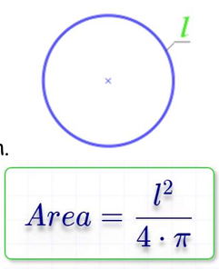

# Problem List

## Problem 1: Print Your Name

Write a program that prints your name to the screen.

### [SOLUTION](./01__Problem__01__Solution.png)

---

## Problem 2: Ask User for Name and Print It

Write a program that asks the user to enter their name and then prints it on the screen.

### [SOLUTION](./02__Problem__02__Solution.png)

---

## Problem 3: Ask User for Name and Print It

Write a program to ask the user to enter a number, then Print “ODD” if its odd, Or “Even” if its even

### [SOLUTION](./03__Problem__03__Solution.png)

---

## Problem 4: Hire a Driver Case 1

Write a program to ask the user to enter his/her:  
 • Age  
 • Driver license  

Then Print “Hired” if his\her age is grater than 21 and s/he has a driver license, otherwise Print “Rejected.

### [SOLUTION](./04__Problem__04__Solution.png)

---

## Problem 5: Hire a Driver Case 2  
Write a program to ask the user to enter his/her:  
• Age  
• Driver license  
• Has Recommendation!  

Then Print “Hired”  

if his\her age is grater than 21 and s/he has a driver license, otherwise Print “Rejected” Or Hire him\her without conditions

### [SOLUTION](./05__Problem__05__Solution.png)

---

## Problem 6: FullName

Write a program to ask the user to enter:  
• First Name  
• Last Name  

Then Print Full Name on screen.   

Example Input:  
Mohammed  
Abu Hadhoud   

Output  
Mohammed Abu-Hadhoud  

### [SOLUTION](./06__Problem__06__Solution.png)

---

## Problem 7: Half Number

Write a program to ask the user to enter:  
• Number  

Then Print the “Half of the <Number> is <???>”.   

Example Inputs:  
 60  
 50  

Outputs :  

Half of 60 is 30   
Half of 50 is 25  

### [Solution](./07__Problem__07__Solution.png)

---

## Problem 8: Mark Pass Fail

Write a program to ask the user to enter:  
• Mark  

 Then Print the “PASS” if mark >=50, otherwise print “Fail”  
 
Example Inputs:  
45  

Outputs  
Fail

### [Solution](./08__Problem__08__Solution.png)

---

## Problem 9: Sum of 3 numbers

Write a program to ask the user to enter:  
 • Number1, Number2, Number3 

Then Print the Sum of entered numbers

Example Inputs:  
10  
20  
30  

Outputs  
60

### [Solution](./09__Problem__09__Solution.png)

---

## Problem 10: Average of 3 Marks

Write a program to ask the user to enter:   
• Mark1, Mark2, Mark3  

Then Print the Average of entered Marks  

Example Inputs:  
90  
80  
70  

Outputs  
80  

### [Solution](./10__Problem__10__Solution.png)

---

## Problem 11: Average Pass Fail

Write a program to ask the user to enter:   
• Mark1, Mark2, Mark3 

Then Print the Average of entered Marks, and print “PASS” if average>=50, otherwise print “FAIL”
 
Example Inputs:  
90  
80  
70  

Outputs  
80  
PASS  

### [Solution](./11__Problem__11__Solution.png)

---

## Problem 12: Max of 2

Write a program to ask the user to enter:   
• Number1 , Number2 

Then Print the Max Number 

Example Inputs:  
10  
20  

Outputs  
20

### [Solution](./12__Problem__12__Solution.png)

---

## Problem 13: Max of 3

Write a program to ask the user to enter 3 numbers:  
• A  
• B  
• C  

Then Print Max number.   

Example Inputs:  
30  
10  
20  

Outputs:  
 30  

 ### [Solution](./13__Problem__13__Solution.png)

## Problem 14: Swap Numbers

Write a program to ask the user to enter:   
•  Number1  
•  Number2  

Then print the two numbers , then Swap the two numbers and print them   

Example Inputs:  
10  
20  

Outputs:  
10  
20  

20  
10  

### [Solution](./14__Problem__14__Solution.png)   

---

## Problem 15: Rectangle Area

Write a program to calculate rectangle area and print it on the screen.  

    

Example Inputs:  
10  
20  

Outputs:  
200  

### [Solution](./15__Problem__15__Solution.png)
---

## Problem 16: Rectangle area Through Diagonal and side Area 

Write a program to calculate rectangle area through diagonal and side area of rectangle and print it on the screen.  

  

The use should enter:  
 A  
 D  

Example Inputs:  
5  
40  

Outputs:     
198.43  

### [Solution](./16__Problem__16__Solution.png)

---

## Problem 17: Triangle Area:

Write a program to calculate triangle area then print it on the screen.   

  

The user should enter:  
a  
h  

Example Inputs:   
10   
8  

Outputs :  
40    

### [Solution](./17__Problem__17__Solution.png)

---

## Problem 18: Circle Area

Write a program to calculate circle area then print it on the screen.   

  

The use should enter:   
R  

Example Inputs:   
5  

Outputs  
78.54  

### [Solution](./18__Problem__18__Solution.png)

---

## Problem 19: Circle Area Through Diameter

Write a program to calculate circle area through diameter, then print it on the screen.  

  

The use should enter:   
D  

Example Inputs:   
10  

Outputs  
78.54  

### [Solution](./19__Problem__19__Solution.png)

---

## Problem 20: Circle Area Inscribed in a Square

Write a program to calculate Circle area inscribed in a square, then print it on the screen.   

  

The use should enter:   
A  

Example Inputs:   
10  

Outputs :  
78.54  

### [Solution](./20__Problem__20__Solution.png)

---

## Problem 21: Circle Area Along the Circumference

Write a program to calculate circle area along the circumference, then print it on the screen.  

  

 The use should enter: L  

 Example Inputs:  
 20  

Outputs :  
31.831  

### [Solution](./21__Problem__21__Solution.png)

---

## Problem 22: Circle Area Inscribed in an Isosceles Triangle

Write a program to calculate circle area Inscribed in an Isosceles Triangle, then print it on the screen.   

  

The use should enter:   
a  
b  

Example Inputs:   
20  
10  

Outputs :  
47.124  

### [Solution](./22__Problem__22__Solution.png)

---

## Problem 23: Circle Area circle Described Around an Arbitrary Triangle

Write a program to calculate circle area Inscribed in an Isosceles Triangle, then print it on the screen.  

  

The use should enter:   
a  
b  

Example Inputs:   
20  
10  

Outputs:  
47.124  

### [Solution](./23__Problem__23__Solution.png)

---

## Problem 24: Validate Age Between 18 and 45:

Write a program to ask the user to enter :  
 • Age 

If age is between 18 and 45 print “Valid Age” otherwise print “Invalid Age”  

### [Solution](./24__Problem__24__Solution.png)

---

## Problem 25: Read Until Age Between

Write a program to ask the user to enter :   
• Age  

 If age is between 18 and 45 print “Valid Age” otherwise print “Invalid Age” and re-ask user to enter a valid age.   

Note: You should keep asking user to enter a valid age until s/she enters it.  

### [Solution](./25__Problem__25__Solution.png)

---

## Problem 26: Print Numbers from 1 to N

Write a program to print numbers from 1 to N.  

Input   
10  

Outputs  
1   
2   
3   
4   
5   
6   
7   
8   
9   
10  

### [Solution](./26__Problem__26__Solution.png)

---

## Problem 27: Print Numbers from N to 1

Write a program to print numbers from N to 1.   

Input  
10  

Outputs : 
10  
9  
8  
7  
6  
5  
4  
3  
2  
1 

### [Solution](./27__Problem__27__Solution.png)

---

## Problem 28: Print Sum Odd Numbers from 1 to N

Write a program to Sum odd numbers from 1 to N.   

Input  
10  

Outputs :  
25  

### [Solution](./28__Problem__28__Solution.png)

---
## Problem 29: Print Sum Even Numbers from 1 to N

Write a program to Sum even numbers from 1 to N.  

Input :  
10  

Outputs:  
30  

### [Solution](./29__Problem__29__Solution.png)

---

## Problem 30: Factorial of N

Write a program to calculate factorial of N!  

Example: factorial of 6 = 6 x 5 x 4 x 3 x 2 x 1 = 720   

Note: User should only enter positive number, other wise reject it and ask to enter again  

Input: 
6  

Outputs:  
720  

### [Solution](./30__Problem__30__Solution.png)

---

## Problem 31: Power of 2,3,4

Write a program to ask the user to enter:  
• Number  

Then Print the Number^2 , Number^3 , Number^4  

Example Inputs:  
3  

Outputs:  
9  
27  
81  

### [Solution](./31__Problem__31__Solution.png)

---

## Problem 32: Power of M

Write a program to ask the user to enter:  
• Number  
• M  

Then Print the Number^M  

Example Inputs:  
2  
4  

Outputs:  
16  

### [Solution](./32__Problem__32__Solution.png)

---

## Problem 33: Grade A,B,C,D,E,F  

Write a program to ask the user to enter:  
• Grade  

Then print the grade as follows:    
• 90 – 100  Print A  
• 80 – 89   Print B  
• 70 – 79   Print C  
• 60 – 69   Print D  
• 50 – 59   Print E  
• Otherwise Print F  

Example Inputs:  
95  

Outputs:  
A  

### [Solution](./33__Problem__33__Solution.png)

---

## Problem 34 Comission Percentage

Write a program to ask the user to enter:  
• TotalSales  

The commission is calculated as one percentage * the total sales amount, all you need is to decide which percentage 
to use of the following:  
• > 1000,000    = Percentage is 1%  
• > 500K to 1M  = Percentage is 2%  
• > 100K – 500K = Percentage is 3%  
• > 50K to 100K = Percentage is 5%  
• Otherwise Percentage is 0%  

Example Inputs:  
110,000  

Outputs:  
3,300  

### [Solution](./34__Problem__34__Solution.png)

---

## Problem 35: Piggy Bank Calculator

Write a program to ask the user to enter:  
• Pennies, Nickels, Dimes, Quarters, Dollars  

Then calculate the total pennies , total dollars and print them on screen giving that:
• Penny = 1  
• Nickel = 5  
• Dime = 10  
• Quarter = 25  
• Dollar = 100  

Example Inputs:  
5,5,5,5,5  

Outputs:  
705 Pennies  
7.05 Dollars  

### [Solution](./35__Problem__35__Solution.png)

---

## Problem 36: Simple Calculator

Write a program to ask the user to enter:  
• Number1  
• Number2  
• OperationType  

Then perform the calculation according to the Operation Type as follows:  
• “+” : add the two numbers.  
• “-” : Subtract the two numbers.  
• “*” : Multiply the two numbers.  
• “/” : Divide the two numbers.  

Example Inputs:  
10  
20  
"*"  

Outputs:  
200

### [Solution](./36__Problem__36__Solution.png)

---

## Problem 37: Sum Until -99

Write a program to read numbers from user and sum them, keep reading until the user enters -99 then print the Sum on screen.   

Input:  
10  
20  
30  
40  
-99  

Outputs:  
100  

### [Solution](./37__Problem__37__Solution.png)

---

## Problem 38 Is Prime Number

Write a program to read a number and check if it is a prime number or not.  

Note: Prime number can only divide on one and on itself.  

Input:  
5  
6  
3  

Outputs:  
Prime  
Not Prime  
Prime  

### [Solution](./38__Problem__38__Solution.png)

---

## Problem 39 Pay Remainder

Write a program to read a TotalBill and CashPaid and calculate the remainder to be paid back.  

Input   
20  
50  

Outputs:  
30  

### [Solution](./39__Problem__39__Solution.png)

---

## Problem 40: Service Fee and Sales Tax

A restaurant charges 10% services fee and 16% sales tax.  

Write a program to read a BillValue and add service fee and sales tax to it, and print the TotalBill on the screen.  

Input:   
100  

Outputs:  
127.6  

### [Solution](./40__Problem__40__Solution.png)

---

## Problem 041 Weeks and Days

Write a program to read a NumberOfHours and calculates the number of weeks, and days included in that number.  

Input:  
365  

Outputs:  
2.17 Weeks  
15.20 Days  

### [Solution](./41__Problem__41__Solution.png)

---

## Problem 042 Task Duration In Seconds

Write a program to calculate the task duration in seconds and print it on screen.  

Given the time duration of a task in the number of days, hours, minutes, and seconds,.  

Input:  
2  
5  
45  
35  

Outputs:  
193,535 Seconds  

### [Solution](./42__Problem__42__Solution.png)

---

## Problem 43 Seconds to Days Hours Minutes Seconds

Write a program that inputs the number of seconds  and changes it to days, hours, minutes, and seconds  
 
Input:  
193,535  

Output:  
2:5:45:35  

### [Solution](./43__Problem__43__Solution.png)

---

## Problem 44: Day Of Week

Write a program to ask the user to enter:  
• Day  

Then print the day as follows:  
• 1 Print Sunday  
• 2 Print Monday  
• 3 Print Tuesday  
• 4 Print Wednesday  
• 5 Print Thursday  
• 6 Print Friday  
• 7 Print Saturday  
• Otherwise print “Wrong Day” and ask the use to enter the day again.  

Example Inputs:    
6  
Outputs:  
Its Friday  

### [Solution](./44__Problem__44_Solution.png)

---

## Problem 45: Month Of Year

Write a program to ask the user to enter:  
• Month  

Then print the day as follows:  
• 1 Print January  
• 2 Print February  
• 3 Print March  
• 4 Print April  
• 5 Print May  
• 6 Print June  
• 7 Print July  
• 8 Print August  
• 9 Print September  
• 10 Print October  
• 11 Print November  
• 12 December  
• Otherwise print “Wrong Month” and ask the use to enter the Month again.  

Example Inputs:  
11  
Outputs:  
November  

### [Solution](./45__Problem__45__Solution.png)

---

## Problem 46: Print Letters from A to Z

Write a program to print all letters from A to Z  

Outputs:  
A  
B  
C  
.  
.  
.  
Z  

### [Solution](./46__Problem__46__Solution.png)

---

## Problem 47: Loan Installment Months

Write a program to read a LoanAmount and Monthly Payment and calculate how many months you need to settle the loan.  

Input:    
5000  
500  

Outputs:  
10 Months  

### [Solution](./47__Problem__47__Solution.png)

---

## Problem 48: Monthly Loan Installment

calculate the monthly installment amount.  

Input:   
5000  
10  

Outputs:  
500  

### [Solution](./48__Problem__48__Solution.png)

---

## Problem 49: ATM PIN

Write a program to read the ATM PIN code from the user, then check if PIN Code = 1234, then show the balance to user,
 otherwise print “Wong PIN” and ask the user to enter the PIN again.  

Assume User Balance is 7500.  

Input:   
1234  
5151   

Outputs:  
Your Balance is: 7500  
Wrong PIN  

### [Solution](./49__Problem__49__Solution.png)

---

## Problem 50: ATM PIN 3 Times

Write a program to read the ATM PIN code from the user, then check if PIN Code = 1234, then show the balance to user, otherwise print “Wong PIN” and ask the user to enter the PIN again. 
Only allow user to enter the PIN 3 times, if fails, print “Card is locked!”  

Assume User Balance is 7500.  

Input:  
1234  
5151   

Outputs:  
Your Balance is: 7500  

### [Solution](./50__Problem__50__Solution.png)

