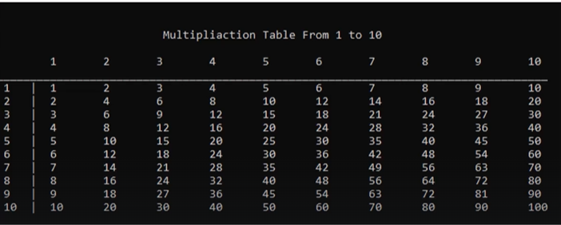

# Problems List - Algorithms and Problem Solving Level 2

## Problem 01 : Print Multiplication Table  1 to 10

;

### [Solution](./01__Problem__01__Level__02__Solution.cpp)

---

## Problem 02 : Print All Prime Number From 1 to N

Write a program print all prime numbers from1 to N.  

Input :  
10  

Output :  
1  
2  
3  
5  
7  

### [Solution](./02__Problem__02__Level__02__Solution.cpp)

---
